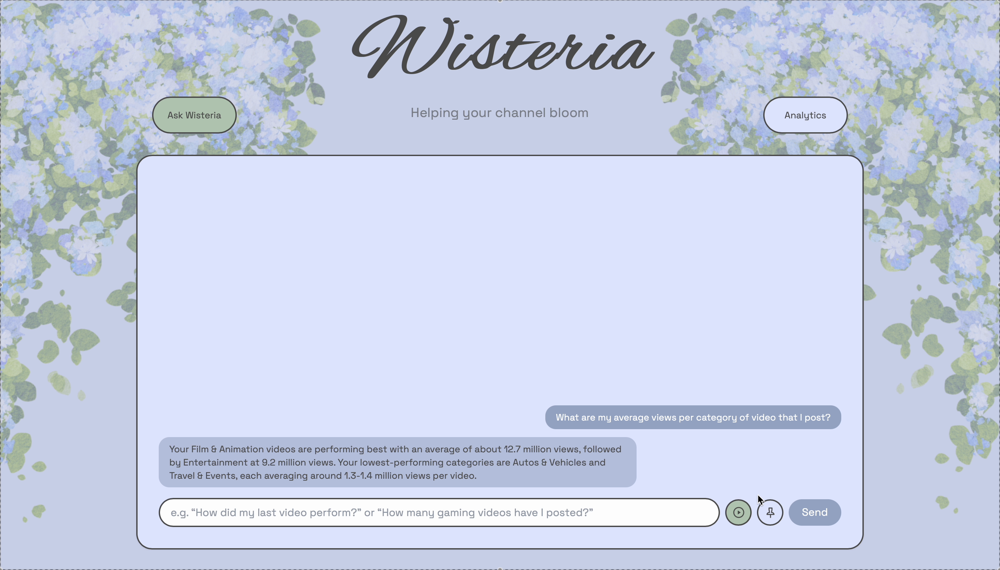
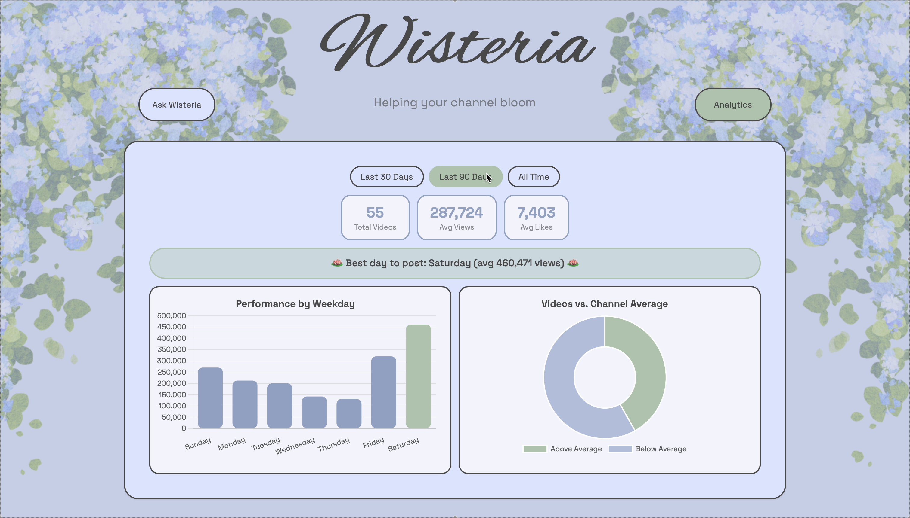

# Wisteria — YouTube Creator Analytics Tool

Wisteria helps YouTube creators understand their channel's performance and predict how a new video might perform *before* they publish it — combining a trained ML model, an LLM-powered chat interface, and a live BI/analytics layer, all built on top of a real cloud data warehouse.

**Skills demonstrated:** Python · SQL · Snowflake (data warehousing, Snowpark) · Machine Learning (scikit-learn, cross-validation, hyperparameter tuning) · LLM integration (text-to-SQL, vision, prompt engineering) · FastAPI · Tableau · Frontend design & development · OAuth2

## Demo

[](https://youtu.be/h3BNZOOuMQk)

*Full walkthrough: real Q&A against live data, a pre-publish performance prediction, and the interactive analytics dashboard.*

## Screenshots

**Ask Wisteria** — real-time Q&A against a live Snowflake connection:



**Analytics dashboard** — native, per-creator, with interactive date filtering:



Both interfaces were custom-designed and built from scratch — a cohesive visual identity (custom typography, a hand-designed color system, illustrated branding), careful attention to conversational UX (loading states, graceful error handling, edge-case guidance for incomplete inputs), not just a functional wrapper around the backend.

## Architecture

```
YouTube Data API / Analytics API  →  OAuth ingestion (auth.py, fetch_data.py)
                                            │
                                            ▼
                              Snowflake — RAW schema (per-creator tables)
                                            │
                              SQL views: weekday performance, best-day-to-post,
                              video-vs-channel-baseline (all NULL-safe for
                              creators with insufficient history)
                                            │
                    ┌───────────────────────┼───────────────────────┐
                    ▼                       ▼                       ▼
            Snowpark ML pipeline    FastAPI backend           Tableau (prototype)
            (training, tuning,      /ask  /upload  /analytics  live Snowflake
             Model Registry)              │                    connection
                    │                      ▼
                    └──────────►   Claude API layer
                                   (text-to-SQL + validation,
                                    vision-based thumbnail comparison)
                                            │
                                            ▼
                                 Vanilla JS frontend
                            (chat interface + native charts)
```

## What it does

### Ask Wisteria — LLM-powered chat
- Open-ended questions ("What are my average views by category?") are answered by having Claude **generate real SQL against the live schema**, then validate it before execution — a word-boundary regex blocks any DDL statement and requires a `channel_id` filter on every query, so a bad or unscoped generation can never run. Results are then summarized back into plain English by a second Claude call. This is retrieval-augmented generation over **structured, queryable data** rather than a vector store — every answer is grounded in a real query result, not a hallucinated guess.
- Attach a video + thumbnail before publishing to get:
  - A **performance tier prediction** (below/typical/above average, relative to that specific channel's own history) from a trained Random Forest model.
  - **Thumbnail feedback** from Claude's vision model, comparing the new thumbnail against that creator's own historical top and bottom performers — not generic advice, but channel-specific comparison.

### Analytics dashboard — native, per-creator
- Real KPIs, a best-day-to-post recommendation, and two live charts (weekday performance, videos vs. channel average), all scoped by `channel_id` from the ground up.
- Interactive date-range filtering (Last 30/90 Days, All Time) recalculates every stat, including the best-day recommendation, consistently across the same filtered window — with a minimum-sample-size guard (`≥5` videos) so a narrow window never confidently recommends a day based on one or two posts.

## ML methodology

- **Target:** performance tier (below/typical/above average), defined by each video's percentile **within its own channel's distribution** (33rd/67th cutoffs), not a raw view-count regression — this makes predictions meaningful across channels of wildly different scale.
- **Features (24 total):** duration, published hour, title length/word count/has-number/has-question/caps-ratio, plus one-hot encoded weekday and category.
- **No data leakage:** `LIKE_COUNT` and `COMMENT_COUNT` are explicitly excluded from features, since they don't exist until after a video is published.
- **Tuning:** `RandomizedSearchCV`, 5-fold cross-validation, 20 iterations. Training accuracy (66%) vs. held-out test accuracy (63%) — a ~3-point gap indicating the model isn't overfit.
- **Baseline comparison:** 63% vs. a 33% random baseline (3-class problem). The below-average tier specifically hits 82% precision — the most actionable signal for a creator deciding whether to adjust before publishing.

## Real engineering challenge worth mentioning

While productionizing the model-loading step, the backend intermittently crashed with a low-level `FileNotFoundError` deep inside Snowflake's own connector library — reproducible from a plain script, unrelated to any code in this project. I traced it to a [documented bug in `snowflake-connector-python`](https://github.com/snowflakedb/snowflake-connector-python/issues/1485) specific to GCS-backed Snowflake accounts, fixed by upgrading the connector — which then surfaced a second, legitimate issue: a version-mismatch safety check between the environment used to train the model and the one loading it, resolved by pinning `cloudpickle`/`scikit-learn` versions to match.

## Tableau prototype

Before building the native analytics dashboard, I prototyped the same analysis in **Tableau**, live-connected to Snowflake:

[**View the interactive Tableau dashboard →**](https://public.tableau.com/app/profile/sruti.medavaram/viz/Wisteria-ChannelAnalytics/Dashboard1)

*(Includes a real dashboard action — clicking a category filters the related chart.)*

I kept the final product's analytics native to the app rather than embedding this dashboard, since a single published Tableau view can't personalize per user — the native charts scale correctly to any number of real creators, while Tableau was the right tool for quickly prototyping the analysis itself.

## Tech stack

| Layer | Tools |
|---|---|
| Backend | FastAPI, Python |
| Data warehouse | Snowflake (live connection) |
| ML | Snowpark, scikit-learn, Snowflake Model Registry |
| LLM | Claude API (text-to-SQL, vision) |
| Frontend | Vanilla JS, Tailwind CSS, Chart.js |
| Auth | Google OAuth (YouTube Data API + Analytics API) |
| BI prototyping | Tableau |

## Known limitations

- **Multi-user login isn't live yet.** Every SQL query and the ML model are already architected to be scoped per `channel_id`, and the OAuth ingestion flow (`auth.py`) works end-to-end for individual creators. What remains is the frontend session/login layer, plus Google's own app verification process for public use of YouTube's sensitive API scopes — a requirement for any app at this stage, not specific to this project.
- **Live deployment is time-limited**, since it runs on a Snowflake trial account. The demo video above reflects the fully working app independent of the deployment's current status.

## Setup

```bash
python -m venv venv
source venv/bin/activate
pip install -r requirements.txt --break-system-packages

cp .env.example .env   # fill in your own Snowflake/API credentials

uvicorn backend:app --reload
```

Then open `frontend/index.html` in a browser.
